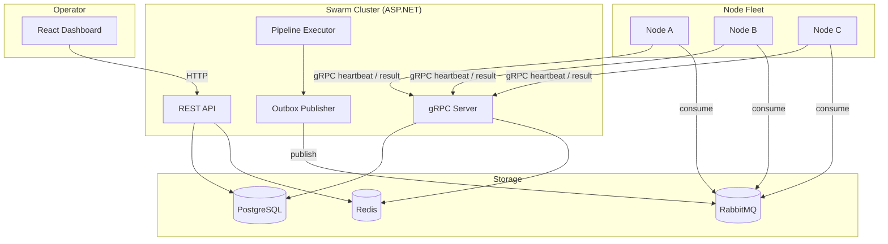
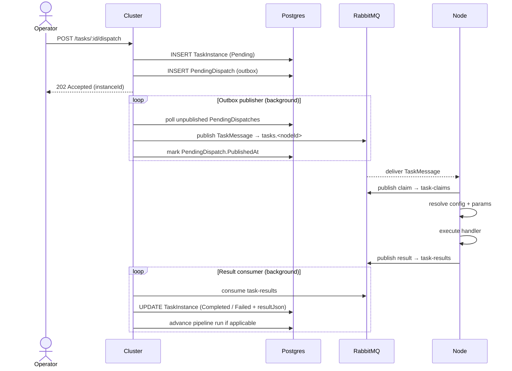
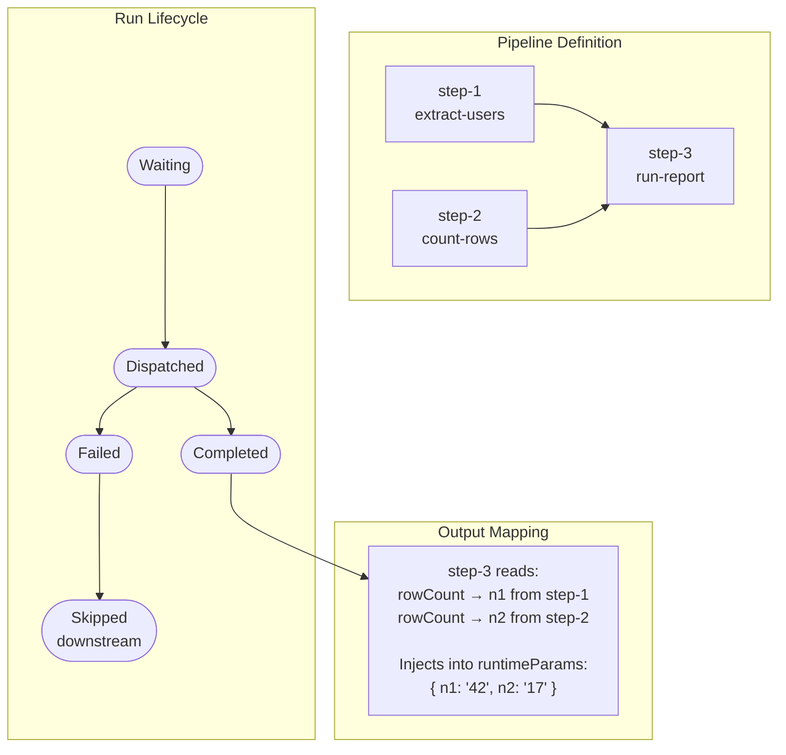
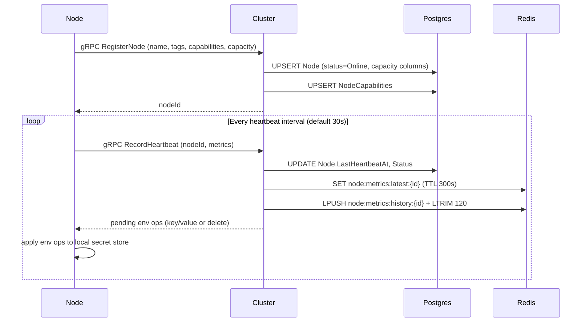
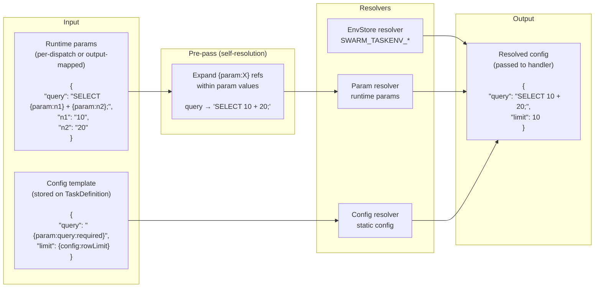

# Swarm — Architecture Diagrams

## 1. System Topology

---

## 2. Task Dispatch Flow

---

## 3. Pipeline Execution

---

## 4. Node Registration & Heartbeat

---

## 5. Value Resolution Pipeline

